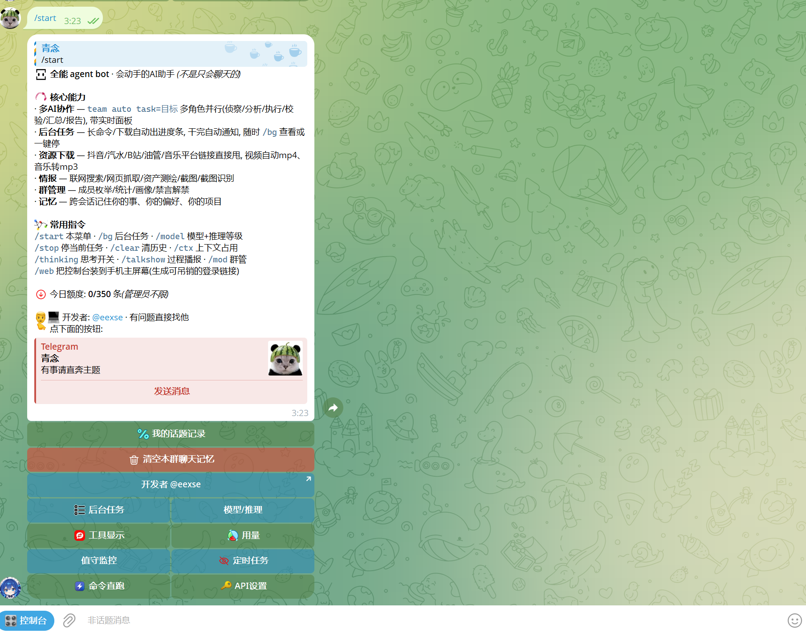

# SPECTRE · 多智能体 Telegram 框架

[](LICENSE)


跑在 **Telegram** 上的自主智能体引擎：多 AI 编排、可扩展工具链、自进化知识库，外加一个完整的 Web 控制台。

作者 / 联系：**@eexse**



---

## 这是什么（以及不是什么）

**是** —— 一个通用智能体框架。机器人本身有完整的工具循环：它自己决定调哪个工具、跑几轮、什么时候收尾；
多个机器人实例可以并行分工、共享一块"黑板"互相通气；知识库可以自己长（把执行经验沉淀成可检索的条目）；
网页控制台和 Telegram 是同一条执行链，不是两套东西。

**不是** —— 它只包含**框架本身**：编排层、工具层、记忆与知识库、Telegram 交互、Web 控制台。
上游自用版本里的引擎扩展与提示词层**不在本仓库范围内**，代码里保留了 `_OSS_DISABLED` 白名单与
`rt()` 守卫：即使模型拿到那些旧工具名，也只会得到一句「该能力不在开源框架版」，不会报错。

请只在你**拥有合法授权**的环境中使用。

---

## 特性

### 一、多 AI 编排

单个机器人有上下文上限，长任务会越跑越糊。这套编排层解决的就是这件事——**把活拆出去干，只把结论收回来**。

| 方式 | 适合什么 | 关键点 |
|---|---|---|
| `subagent` | 要翻很多文件/抓很多网页才能得出结论 | 独立上下文，只把最终结果回给你，**不占主对话的上下文** |
| `subagent act=parallel` | 彼此独立的多个子任务 | 并行派发 |
| `team` | 复杂任务、需要多角度 | 多角色分派 + 流程锁定（拆解→并行→汇总一条龙） |
| `workflow` | 任意任务清单的 fan-out | 比 team 通用：`tasks` 数组 + `stages` 多阶段流水线，上一阶段结果喂下一阶段 |
| `ralph` | 反复试错型长任务（调参、逐步逼近） | **每轮都开全新上下文**，只把目标+结论链交给它，不会越跑越钻牛角尖 |
| `goal` | 跨多轮才能完成的活 | 钉在会话上，没做完自动一轮轮接着干 |

**队友黑板**：同一批派出的子代理共享一块黑板，可以用 `SAY: 一句话` 广播发现、互相提示、
共享"已经排除掉的方向"——避免同一个坑被踩三遍。

### 二、工具层

内置工具 60+，按能力分几类（完整定义见 `deepseek_bot/tools_schema.py`）：

| 类别 | 工具 |
|---|---|
| 基础执行 | `sh` `read` `write` `edit` `sys` `file` |
| 信息获取 | `search`（四引擎并行，含深度检索）`url`（抓页面/抽信息/下载）`fofa` `agent_reach` |
| 多模态 | `img`（视觉理解/OCR）`pdf` `shot` `captcha` |
| 编排 | `team` `subagent` `workflow` `ralph` `goal` `todo` |
| 记忆与状态 | `memory` `group_memory` `conversation_search` `project` `state` |
| 运维 | `watch`（值守，只在变化时通知）`schedule` `notify` `report` `parse` |
| 通讯 | `tg`（多号操作）`group`（群管理）`whois` `ask` |

**声明式插件**——这是这套框架最实用的设计：新工具不用改主程序。
往 `knowledge/toolPlugins/` 丢一个 JSON + 一个脚本，重启后自动注册。

```json
{
  "name": "my_tool",
  "description": "告诉模型什么时候该用它",
  "schema": {
    "type": "object",
    "properties": { "text": { "type": "string", "description": "参数说明" } },
    "required": ["text"]
  },
  "exec": "/opt/deepseek-bot/knowledge/toolPlugins/my_tool.py",
  "admin_only": true,
  "timeout": 60
}
```

脚本从 `sys.argv[1]` 读 JSON 参数、往 stdout 打结果即可：

```python
import json, sys
a = json.loads(sys.argv[1])
print("收到:", a.get("text"))
```

插件与内置工具同名时以内置为准；`admin_only: true` 的工具只有管理员名单里的 ID 能用。

### 三、自进化与记忆

- **知识库 TRIGGER 机制**：`knowledge/**/*.md` 文件头写 `<!-- TRIGGER: 关键词1|关键词2 -->`，
  模型遇到相关场景时会自动检索并注入对应内容。**不写 TRIGGER 就检索不到**，这是最容易踩的坑。
- **自沉淀**：任务里发现的新知识点写进 `knowledge/self_learned/`，下次自动可用。
- **执行链蒸馏**（`atk_meta`）：把成功的执行链去特化成"可迁移的成功路径"入库，下次遇到同类任务自动回灌。
- **长期记忆**：跨会话记住用户的事实、偏好、项目；群聊另有独立画像（谁擅长什么、群里的梗）。
- **状态固化**（`state_engine`）：项目自动落 `state.md`，用户说"继续"时先读状态再动手，断点不丢。

### 四、Telegram 侧体验

- 流式输出 / 打字机效果 / 心跳状态（一条消息走完「⌛️ → 逐字冒出 → 完整结果」，不删不重发）
- 任务清单面板（多步任务自动列计划并打勾）
- 私聊话题（Bot API 9.4）：一个私聊里开多个话题，一个话题就是一个独立工作台
- 富文本：真表格、自定义动画表情、动态时间实体 `(dt:r)`
- 值守 / 定时任务 / 群管理 / 多模态（看图、OCR、PDF、语音）
- 拟人化：心情值系统、随机延迟、被骂会怼回去（可关）

### 五、Web 控制台（Mini App）

前端在 `miniapp-src/`（Vite + React + Tailwind，自带一套自研的 `dsh` 设计系统），
构建产物已随仓库附带，**不用装 node 也能直接跑**。

- 对话（实时流式 + token 计量 + 子代理执行过程可点开看）
- 概览 / 任务 / 工作台 / 值守 / 文件 / 设置 / 账单
- 与 Telegram **同一个进程、同一份状态**，不是另一套程序
- 自带 HTTPS 一键脚本 `miniapp-src/setup_https.sh`（Telegram Mini App 必须 HTTPS）

---

## 架构

```
deepseek_bot/              框架主程序
  bot.py                   核心：工具 schema / 执行器 rt() / 提示词分层 / 心跳 / 面板 / 回调
  miniapp_server.py        Web 控制台后端（FastAPI，与 bot 同进程）
  tools_schema.py          工具定义表（模型能看到的工具清单）
  prompts.py               可热改提示词的注册表
  rich_msg.py              富文本（Telegram Rich Message：表格 / 自定义表情 / 实体）
  parallel.py              多 AI 编排（team / workflow / subagent）
  atk_meta.py              自进化：成功执行链的蒸馏与回灌
  memory_engine.py         长期记忆与语义检索
  group_memory.py          群聊画像
  state_engine.py          状态固化（断点续跑）
  rag_engine.py            知识库检索
  parser.py                20+ 种工具输出的结构化解析
  reporter.py              报告生成（Markdown / PDF）
  scheduler.py             定时任务
  scan_cache.py            结果缓存
  watchdog.py              进程守护
  monitor.py               外部信息监控
  db.py                    数据层
  run.py                   启动入口
defense/                   提示词注入防御检测
knowledge/
  toolPlugins/             声明式插件（JSON + 脚本，免改核心）
  self_learned/            模型自己沉淀的知识
  suggestions/             模型给主人提的改进建议
miniapp/                   Web 控制台构建产物（已就绪）
miniapp-src/               前端源码
docs/                      使用手册 / 功能与测试指南 / 测试提示词
assistant_api.py           OpenAI 兼容 API 服务（可选，独立进程）
tg_user.py                 多账号操作脚本
```

---

## 快速开始

### 环境要求

- Python **3.10+**
- 一个 Telegram bot token（找 @BotFather 要）
- 一个模型 API key（任何 OpenAI 兼容端点都行）

### 安装

```bash
git clone https://github.com/qingnian112233/spectre.git
cd spectre
python3 -m venv .venv && .venv/bin/pip install -r requirements.txt
cp .env.example .env      # 填 DEEPSEEK_API_KEY 与 DEEPSEEK_BOT_TOKEN
mkdir -p sessions
.venv/bin/python -m deepseek_bot.run
```

首次运行会用 bot token 登录（不需要手机号）。

### 部署路径

代码里默认的部署目录是 **`/opt/deepseek-bot`**（知识库、session、日志、插件的绝对路径都指向它）。
装到别处就全局替换一次：

```bash
sed -i 's|/opt/deepseek-bot|/your/actual/path|g' deepseek_bot/*.py *.py knowledge/toolPlugins/*.py
```

### ⚠️ 必改（5 分钟）

开源版把真实 TG ID 换成了 `None` 占位、把服务器地址换成了 `YOUR_HOST`。
**不改成你自己的数字 ID 就没有管理员**（`None` 永不等于任何 chat_id，所以也不会把管理权误给陌生人）：

```python
deepseek_bot/bot.py            OK = {None}              → OK = {你的TG_ID}
assistant_api.py               _ADMINS = {None}         → _ADMINS = {你的TG_ID}
tg_user.py                     "tg_id": 0               → 你的 TG ID
deepseek_bot/miniapp_server.py PUBLIC_URL               → 你的域名
.env                           DSB_WEB_URL              → 你的域名
```

查自己的 ID：随便找个 userinfo bot，或看机器人启动日志里的 `chat_id`。

### 配置项（.env）

| 变量 | 说明 |
|---|---|
| `DEEPSEEK_API_KEY` | 模型 API key（必填） |
| `DEEPSEEK_API_BASE` / `DEEPSEEK_API_BK` | API 端点（主 / 备用，主通道故障自动切换） |
| `DEEPSEEK_BOT_TOKEN` | Telegram bot token（必填） |
| `TG_API_ID` / `TG_API_HASH` | Telegram 应用凭据（多号功能需要） |
| `FOFA_API_KEY` / `FOFA_EMAIL` | 资产测绘（可选） |
| `QWEN_API_KEY` | 向量 / 多模态（可选） |
| `PROXY_DYNAMIC_URL` | 动态代理池（留空 = 直连） |
| `DSB_BRAND` | 显示名（默认 `SPECTRE`，也可用 `/brand` 命令改） |
| `DSB_WEB_URL` | Web 控制台公网地址 |

---

## 用法示例

**派个子代理去干重活**（不占你的对话上下文）

```
帮我调研一下 xxx，直接派子代理去翻，只要结论
```

**让它自己列计划并打勾**

```
把这件事拆成步骤，边做边标记进度
```

**多个独立子任务并行**

```
这三个域名分别查一下备案和指纹，并行跑
```

**钉一个跨轮次的目标**

```
把这件事设成目标，没做完就自己接着干
```

**让它自己造工具**（框架自带 `selfext`，自测通过即热加载）

```
现有工具不够用的话，你自己写个插件解决
```

---

## 定制

| 要改什么 | 改哪里 |
|---|---|
| 管理员名单（必改） | `bot.py` 顶部 `OK = {...}` |
| 人格 / 语气 | `bot.py` 里的 `_OSS_SELF`（自身身份 / 性格 / 表达）与 `_TONE_SYS` |
| 模型档位与通道 | `_PROV` 常量 + `/model` 面板（管理员可在面板里直接改 key 与入口） |
| 可热改提示词 | `/prompt` 面板，注册表在 `deepseek_bot/prompts.py`；对应文件在 `knowledge/` 下 |
| 知识库 | 往 `knowledge/` 丢 `.md`，**文件头必须写 TRIGGER** |
| 新工具 | 往 `knowledge/toolPlugins/` 丢 JSON + 脚本（见上文「声明式插件」） |
| Web 控制台 | `miniapp-src/`，`npm run build` 后把 `dist/` 拷到 `miniapp/` |

---

## 常见问题

**Q：机器人不回复群消息？**
群里默认只旁听收录、不插话。要么 @ 它，要么消息里带上它的显示名（`DSB_BRAND` 的值）。

**Q：网页控制台打不开 / 一直转圈？**
Telegram Mini App 必须要 HTTPS + 有效证书。用 `miniapp-src/setup_https.sh`，没域名可以用
`sslip.io` 免费泛解析（把 IP 的点换成横线，如 `1-2-3-4.sslip.io`）。

**Q：知识库写了但模型检索不到？**
文件头缺 `<!-- TRIGGER: 关键词 -->`。这是唯一的检索入口，不写就等于没写。

**Q：新加的插件不生效？**
JSON 必须有 `name` / `description` / `schema` / `exec` 四个字段，且 `exec` 指向服务器上的**绝对路径**。
改完要重启进程。

**Q：怎么改掉那条"我不是真人"的口径？**
`bot.py` 里搜 `_OSS_SELF`，那是身份段的唯一来源。

---

## 与上游完整版的关系

本仓库是**框架版**。上游自用版额外包含引擎扩展模块与提示词层，那些不在开源范围内
（代码里对应的模块文件未打包，`rt()` 有守卫拦截）。

想加回任何一类能力，推荐走 `knowledge/toolPlugins/` 声明式插件——不用碰核心，升级也不冲突。

---

## 使用边界

本项目用于**授权的**安全测试、红队演练与学术研究。使用者必须确保对目标拥有合法授权，
并自行承担合规责任；作者不对任何未授权使用负责。

---

## License

[AGPL-3.0](LICENSE) —— 可自由使用、修改、分发；**若作为网络服务对外提供，必须公开你修改后的完整源码**。

Copyright (C) 2026 青念 (@eexse)
